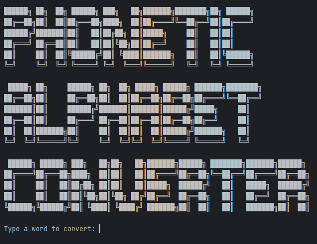
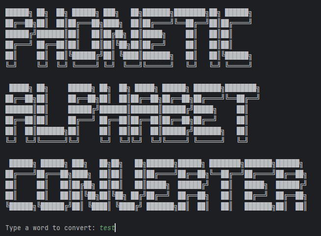
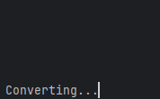
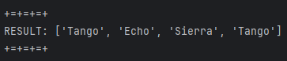
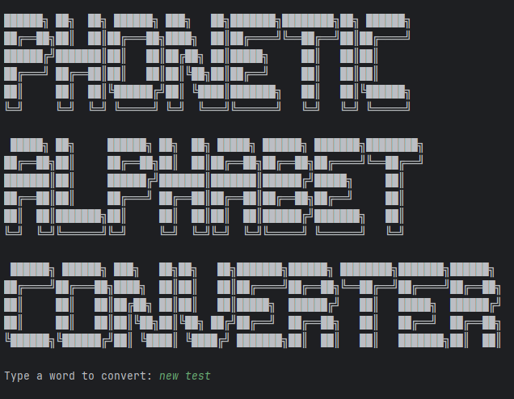
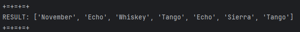

# Conversor de Palavras para Alfabeto Fonético
Utilizando dictionary comprehension, converte palavras digitadas pelo usuário em uma lista de palavras, onde cada uma dessas palavras corresponde a uma letra no alfabeto fonético.

**CONVERSOR EM FUNCIONAMENTO:  **

Ao iniciar o programa, ele pedirá uma entrada (a palavra a ser convertida):

Teclando enter, ele dará início a conversão: 

Em seguida, exibirá o resultado: 

** OBS: Também funciona para sentenças! **

---
**Desenvolvido por:** Anderson Luis

**GitHub:** https://github.com/andluis35

**Linkedin:** www.linkedin.com/in/anderson-luis-663970325

## Módulos Utilizados
* Pandas
* Time
